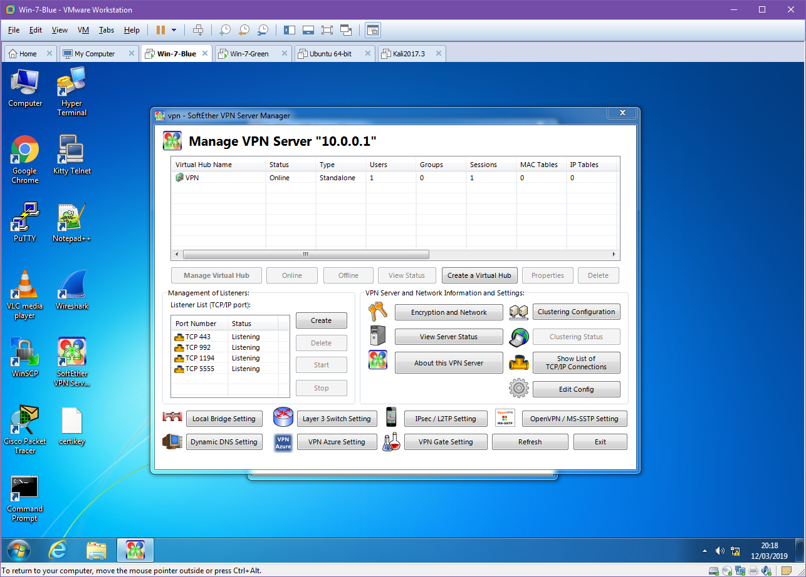

# Flaws In The WEP Protocol And Proposal For Improving Security Of The WEP Network
_Shaw Eastwood_

##### Abstract

A discussion of the issues inherent in the WEP protocol and the RC4 cipher stream it uses. A discussion of potential countermeasures for a network that must deploy a WEP network and the implementation of a IDS system. Finally a discussion of the ethics of the field.
## Introduction
This document is broken into three sections and will detail the issues raised. The first section is on the inherent security issues and weaknesses found in the Wired Equivalent Privacy (WEP) and the pressing need to upgrade the wireless infrastructure. The second section will contain my proposal and test implementation of a solution to improve the security of the WEP network, through the use of an Intrusion Detection System (IDS), a firewall and a Virtual Private Network (VPN) implementation such as WireGuard (SE) to protect the network and the data. Finally the last section will be a discussion of the ethics of white hat hacking and penetration testing. Included will be the ethical framework and standards that ethical hackers operate on.
## Wired Equivalent Privacy

_By Traced by User:Stannered, original by en:User:Mhandley en:Image:Wep-crypt.png, CC BY-SA 3.0,
https://commons.wikimedia.org/w/index.php?curid=1893247_

The WEP algorithm was introduced with the IEEE 802.11 wireless standard in 1997 which was an extension to the 802 Local Area Network (LAN) protocols to add Wireless functionality (WLAN). As the
name suggests it was intended to provide a similar level of confidentiality to the wireless network as was already present on existing LAN’s. The protocol implements this by providing packet level encryption for data being transmitted over the network provided by Rivest Cipher 4 (RC4) and the Cyclic Redundancy Check 32 (CRC-32) to ensure packet integrity. The algorithm creates either a 64 or 128 bit key comprising of a 24 bit Initialisation Vector (IV) and either a 40 or 104 bit Pre Shared Key. This restriction allowed for either 5 or 13 ASCII character passwords respectively (or 10 or 26 hexadecimal strings). WEP was pervasive until major security flaws were discovered and the 802.11i revision was issued which introduced Wi-Fi Protected Access (WPA). However a number of issues became clear with the WEP algorithm during its lifespan.
### Rivest Cipher 4 (RC4)
The first issue described is actually an issue with the stream cipher used Rivest Cipher 4 (RC4). The stream cipher was first devised in 1987 it was used in a number of predominantly protocols up until 2015 such as WPA (version 1), SSL and TLS. The algorithm was, and still is, a proprietary algorithm practicing "security through obscurity" however an anonymous user posted the source code in 1994 to a usenet. Though despite creating an identical output it was never confirmed to be the actual source code and is thus reffered to as "Alleged RC4" ARC4. The algorithm is remarkable for its simplicity, being only 76 lines of code, and for its speed, requiring only 19 instructions for each random value. The algorithm takes an input of an IV and a Key, the algorithm then repeats the key until it has a 256 byte key. This key is then "permutated" by iterating through the key and swapping the bytes indices and then used to generate a keystream.

### RC4 Issues
One minor flaw that exists with this lies in the first 256 bytes of the resulting RC4 keystream being disproportionally non random, thus in most implementations of RC4 the first  ̃256 bytes are discarded. This is not the case in WEP and thus the initial output of the stream is susceptible (Roos, 1995). A second flaw that reveals that the relationship between the first 8 bytes of the key, if chosen correctly, can inform on the remaining half of the key. This flaw is not an issue in the SSL implementation of RC4 as SSL uses MD5 to hash the key before it used (Wagner, 1995).

### WEP Issues
These issues in RC4 can be avoided as described, discarding the initial  ̃256 byte output and hashing the key before using it however WEP implements neither of these. In fact WEP’s implementation makes the situation worse by regenerating the keystream, with a fresh IV, for each packet, meaning that it is very easy to capture a wide variety of IV’s. Further the 802.11 protocol has a number of static plaintext elements that it embeds into the packet header (Grier, ). These known bytes allow the attacker to make informed assumptions about the ciphertext packets being examined. In 2001 it was discovered in the Fluhrer, Mantin & Shamir (FMS) attack that certain IV’s had a predictable resulting output. Since the IV used is known, as it is transmitted in plaintext with the ciphertext, a wide range of IV’s can be quickly obtained. An attacker can then use a voting system to guess at the a next byte of the key, repeatedly, until the entire secret key has been revealed (Fluhrer, 2003). It is worth mentioning that the FMS attack is a vulnerability in RC4. However it is due to the nature of the WEP implementation of RC4 that makes it viable. The second major issue with WEP is the size of the Initialisation Vector (IV). As WEP uses a Stream Cipher and not a Block Cipher it is imperative that the traffic key not be reused. However with a 24 bit IV the possible permutations are only 2 24 or 16,777,216 significantly increasing the likelihood of key repetition to %50 after only 300,000 packets. Further, with an aggressive method of replaying Address Resolution Protocol (ARP) requests a sufficient number of packets to retrieve the secret key can be obtained in under a minute (Tews, 2007).

### General WEP Issues
Of the issues described above, the largest issue with 802.11 (WLAN) is the fact its wireless. Packets sent across the network can be picked up by anyone sitting within range of the Access Point (AP) which is a major disadvantage over the wired 802 (LAN) which requires physical access. An attacker wishing to do an aggressive attack on an 802.11b AP, 11 Mbit/s throughput, assuming the standard Maximum Transmission Unit (MTU) and a consistent network connection would be able to capture the full range of possible IV’s in 5 hours. This was discovered to be unnecessary in as an attack success rate of 50% can be achieved after capturing only 40,000 packets (increasing to 95% at 85,000 packets). The 802.11g standard introduced the 54 MBit/s (22 Mbit average maximum throughput) specification, a major step up in bandwidth and reducing the time to retrieve all possible IV’s within an hour. This even further reduced the time taken in the average aggressive attack to less than a minute (Tews, 2007). Further, the use of the static PSK for encrypting the traffic means that an attacker can capture a large amount of traffic quickly and then disconnect from the network and break the encryption offline. This is less of an issue as the previous one as the time taken to break WEP is so small.

## Proposal
To improve the security of the highly vulnerable WEP section of the Greenshoots Ltd. a number of options exsist. The primary tool we are going to use for this is a VPN, which will create another layer of security on the network.

In it’s simplest form a VPN is just a connection between two nodes, these can be phones, computers, servers etc. It does this by constructing a "tunnel" in which the "private network" exists, this can be done over any network from a LAN to the public internet. A VPN will encrypt all of the traffic travelling through the tunnel itself meaning that we are no longer handing WEP a plaintext message but instead ciphertext from our VPN implementation of choice. The network is only accessible once a user has passed an authentication check in the form of either a Username and Password or in the form of This means that if (or when) the WEP security is broken, the data will still be unreadable by an attacker.

### SoftEther VPN
SoftEther is a long standing open source VPN implementation written in C and C++ available for all of the major platforms. SE’s own VPN language is a Layer 3 implementation licenced with Apache and written in C making it suited for the range of devices that would benefit from the VPN. It also has the ability to deploy a number of other VPN implementations from OpenVPN to IPsec, however for our demonstration setup the native implemnentation will be sufficient. By default SoftEther authenticates clients to a self generated certificate and individual key which an administrator must provide to each client connecting. For a production enviroment, a more lightweight implementation such as IPsec or WireGuard may be more prefereable if the throughput on the network is required to be unhampered.

### Implementation
The SoftEther package comes in two binary’s, an installable server and client. For our demonstration two VM’s will be used to act as two nodes on our network, both running Windows 7 SP 1 named Blue and Green respectively, with a Kali Linux VM acting as a hostile unauthenticated attacker, listening to our traffic. Kali will have a running Wireshark instance listening on the NIC attached to the network with other VM’s and we will be monitoring the traffic as weping between our two machines before and after the VPN setup. Our network will be setup such that all three machines are in the same subnet, although in the wild the Kali Linux machine would not need to join the network merely have a Wireless NIC in promiscuous mode. Our Windows Server, Blue, will be 10.0.0.1, our Windows Client, Green, will be 10.0.0.2, while Kali will be 10.0.0.3.

#### IP Addresses
Virtual Machine | Role | IP address
--- | --- | ---
Windows 7 Blue | Server | 10.0.0.1
Windows 7 Green | Client | 10.0.0.2
Kali Linux | Attacker | 10.0.0.3

Initially we will send a ping from our Blue Server to our Green Client with ping 10.0.0.2 and obserce in Kali linux that we see a cleartext ICMP packet being sent and its associated reply.

Now we know that all VM’s are connected and working and we have data being transmitted in clear we can begin the VPN setup.
### Installation of SoftEther

During the installation it is important to choose the avaiable "SoftEther VPN Server" and "SoftEther VPN Client" options during the server and client installation respectively.

#### Server Setup

SoftEther allows a number of configurations on the VPN Server. In our demonstration the Remote Access VPN Server will be used as it provides far more functionality than we require, creating a bridge between remote locations and our local network. This is intended to allow authenticated remote users to access local resources such as files available on a local intranet, for example. However while this is far outside the remit of our demonstration, it will provide the basic functionality we require. In a production environment this VPN would not be on the edge of a network (unless it was providing the entire company VPN) and thus would not be exposed itself.

Once we have selected the appropriate type of VPN for our implementation, we must configure the server. As we said earlier our Windows Blue Server will be 10.0.0.1 so we will set the hostname accordingly. For the Port, we do not need to worry about changing this as this will be the only server running on this VM. If we wanted to have multiple instances or had a firewall with only a specific port opened then we would need to change this. Finally our adminstrator password is up to the discretion of the network administrator setting this up, however it would be good practice to ensure this was a strong password.

Next we we need to create the certificate for our client which our server can use to ensure that our client is who they say they are. In production we would likely see this certificate entered into a Certificate Authority (CA) which is a central, trusted, authority which would allow the network administrator to easily handle and manage many certificates easily without the need to manually create a new one for each user. However again, for demonstration purposes this is unnesecary and we will just issue a Self-Signed Certificate and distribute this to the clients manually.

#### Certificate Details
Common Name(CN) | User001
--| ---
Organization (O) | Greenshoots Ltd.
Organization Unit (OU) | IT
Country (C) | UK
State (ST) | Scotland
Locale (L) | Aberdeen
Seriel Number (Hex) | N/A
Expires | 3650 Days

Creating this certificate will give us the file with which we can authenticate the client connectiing to the server with. With this proccess hooked up to an Lightweight Directory Access Protocol (LDAP) or Active Directory (AD) server, the certificates could be tied to those user profiles and would be generated and expired as the LDAP/AD accounts were. When exporting we have a choice of options, the standard X509 will provide us with two files a .cer and a .key which will both be needed by the user when connecting to the server.

Once we have completed this our VPN can be started and we will be looking at the an information screen with various options and information regarding users connected. From here we will need to move to the client and connect them to the server. It is important to remember to move the .cer and .key files over to the client as they will be required.
#### Client Setup

Our client setup is far more simple than our server setup. The hostname will need to be set to that of the server running the SoftEther VPN server instance, in our case the Windows 7 Blue VM at 10.0.0.1 or to a hostname vpn.greenshoots.local if one has been set and the port, unless changed on the server configuration, will need to be set to 5555. If a hostname is chosen it is important that the DHCP server providing the clients can also provide the domain name resolution of internal hostnames otherwise this will not work.

#### Client Configuration
Hostname | Port
--- | ---
10.0.0.1 | 5555

Next the .cer and .key moved over from the server must be chosen and if a passphrase was entered on the server when exporting the certificate it must be entered here to decrypt the key. For a production enviroment a certificate for the server itself should be made and registered for the VPN to protect against a Man In The Middle (MITM) attack.

Looking at the Client we can now see that we are connected to the server.

#### Test the VPN
To test if the VPN is configured successfully we will now finally switch to the Kali Linux VM. As we saw in figure X the unencrypted ICMP ping packet can be easily read by Wireshark, although it contains no real useful information it serves to demonstrate that it can be read. One slight flaw in SoftEther is that it doesn’t encrypt ICMP packets by default. This is not a deal breaker as our data will still be encrypted, as ICMP is mainly for diagnostics and error reporting information. We must now setup Wireshark to listen to the traffic on the network, we can either wait for a handshake, a keepalive transmission or generate some data between the two machines ourselves. For example a "TCP ping" by using traceroute with the -P tcp set from our Client to our Server, which will generate some traffic for us.

Looking at the output collected by wireshark of a typical movement of data between the client and the server. We can see that the data is being sent as a UDP stream, a typical way for VPN’s to move encrypted packets. Using Wireshark’s "follow UDP Stream" tool we can see the entire contents of all the packets and as we can see it is encrypted.
### Other methods
#### Intrusion Detection System
An intrusion detection system would ensure that a system administration could monitor all access to the network. If a device or user connected that was not recognised an issue would be flagged. This would then either require manual checking or some kind of of automated blocking of that user. An implementation of this is Snort snort.org which is an "open source intrusion prevention system capable of real-time traffic analysis and packet logging" (Snort, 2019). This would be simple to implement on the network as binaries are available for Windows and Linux. However as we already have the VPN tunnel setup our data is secure and this type of system would only help us know if someone was attempting to access our network.
#### Firewall
A firewall is an extremely simple way of blocking traffic. It operates through ports, "opening" them if a rule is set to allow this, much like removing a brick from a wall and allowing things to pass through the hole. This is extremely important on machines exposed to the internet to ensure that no unintended service is opened to the public. The two primary implementations for a network of our size would be Windows Firewall, for a windows server, and uncomplicated firewall, ufw, for a linux machine. Windows provides a GUI for adding and deleting rules based on programs registering themselves to a port and allowing the administrator to allow or deny it. Linux’s ufw on the other hand is a very lightweight tool where rules are added manually with ufw allow 5555 where "5555" would be the port number. However again, although very useful for the purposes required here "protecting network access" we do not require it.
## 3. The Ethics of Whitehat Hacking
To combat the any concerns to the legitimacy of the ethics and profession of hacking this section will detail the reasons for it. Below will detail the ethical framework and professional standards that ethical hackers operate within.
### The Ethical Hacking Framework
The process of attempting to hack something is not without structure. In both whitehat and blackhat hacking there is a process that attackers follow to ensure that their work is thorough and repeatable. This is especially true for whitehat hackers where they need to be able to show the process taken to uncover the flaw. If a company requests an attack to be made (for threat discovery in a controlled way) then they may designate "Off limits" devices or servers that an ethical hacker should not touch for various reasons. This is an example of the process that whitehat hacking companies or individuals undergo to ensure that the ethics of the field are maintained.
### Code Of Conduct
A code of conduct is commonplace in many institutions and groups across the world and across most fields. It is a pre agreed set of rules that say what you cannot do and if you are in breach of these rules you will receive some kind of punishment. This is no different in the ethical hacking field. The Association for Computing Machinery (ACM) is one of the widely cited code of conducts and lists a number of common sense rules for conducting business in the field of penetration testing (Machinery, 2018). The EC-Council list 19 rules that range from "no private information should be gained [during a pen test]" to "Ensure all ... testing activities are authorized and within legal limits". These are sensible rules that any ethical person would agree on (EC-Council, 2019). The rules also advise professionals on the extent of the limits to where they should be attempting to gain access, unless otherwise specified by the target, and helps to ensure they can do their job.
### Certifications
Certifications exist for professionals working in the field to show that they both meet a certain standard of competency and that they at least understand an ethical code of conduct. These certifications prove that penetration testers can legally and professionally identify and report security flaws without breaching legislation, such as the Computer Misuse Act 1998. A number of bodies exist which offer these, listed as follows.
* Certified Ethical Hacker (CEH)
* Offensive Security Certified Professional (OSCP)
* Global Information Assurance Certification Penetration Tester (GPEN)

#### Certified Ethical Hacker
The CEH certification is issued by "EC-Council" and is describes the holder who is a "Skilled professional who understands how to look for weaknesses and vulnerabilities" and who reports them in a "lawful and legitimate manner". The certification lasts for 4 years before needing to be renewed. By training certificate holders with the same tools as a malicious hacker the aim is to have them be better informed than other methods as to how an attacker would approach attacking a system so as to better be able to prevent an attack. Further the certificate helps to combat any misconception of ethical hacking by "establishing minimum standards" and "reinforcing ethical hacking as a ... slef-regulating profession" (EC-Council, 2019).
#### Offensive Security Certified Professional
OSCP is the least known of the three listed here but is possibly the most technically demanding of the three. It aims to provide less of the ethical framework and instead focuses more on the "employability" aspect of ethical hacking. This is due to it being provided by a private company "Offensive Security" whom advertise it as "the only fully hands-on certification program" (Security, 2019).
#### GIAC Penetration Tester
The GPEN certification is designed for industry professionals who work in threat assessment and lasts for four years, much like the CEH. It includes objectives to teach "penetration-testing methodologies, the legal issues surrounding penetration testing and how to properly conduct a penetration test" The Most common way to obtain this certification is by taking the SEC560 which is a comprehensive course that demonstrates that the holder understands the theory and has the practical knowledge to implement it (Certification, 2019).
### Computer Misuse Act 1990
There are a number of laws surrounding the illegal use of computers and access of networks but none so prolific as the Computer Misuse Act of 1990 (CMA90). The law clarified the law on the unauthorized access to a system or network and allowed the prosecution of people gaining access. It has becoming a model for a number of other countries and has been described "as a robust and flexible piece of legislation in terms of dealing with cybercrime" (Inkster, 2011). The act is designed to protect computer users from wilful attacks and theft of Personal Information. The offenses it covers are as follows;
* Hacking
* Unauthorized Access to Computer Systems
* Altering Software and Data
* Preventing Access of Legitimate Users
* Interfering with standard Operation
This piece of legislation is a solid document that ethical hackers can use as a point of reference to both the legality of what they can do and how far their penetration tesing can go.

## References
Roos, 1995.
Andrew Roos, A Class of Weak Keys in the RC4 Stream Cipher (1995)
https://pdfs.semantic-scholar.org/788c/9474b2f74ff56253cdf799e71a3ef4d5f77c.pdf

Wagner, 1995.
David Wagner, Predictability of RC4 Keystream (1995)
http://www.cs.berkeley.edu/daw/my-posts/my-rc4-weak-keys

Grier,.
Chris Grier, Mike Perry, and Andy Washington, The History and Background of RC4.
https://fscked.org/proj/minihax/WirelessSec/rc4.html

Fluhrer, 2003.
Scott Fluhrer, Itsik Mantin, and Adi Shamir, Weakness in the Key Scheduling Algorithm of RC4 (2003)
https://www.mattblaze.org/papers/others/rc4_ksaproc.pdf

Tews, 2007.
Erik Tews, Ralf-Philipp Weinmann, and Andrei Pyshkin, Breaking 104 Bit WEP in Less Than 60 Seconds (2007)
http://merlot.usc.edu/cs531-s15/papers/Tews07a.pdf

Snort, 2019.
Snort, What is Snort (2019)
https://www.snort.org

Machinery, 2018.
Association for Computing Machinery, ACM Code of Ethics and Proffesional Conduct (2018)
https://www.acm.org/code-of-ethics

EC-Council, 2019.
EC-Council, Code of Ethics (2019)
https://www.eccouncil.org/code-of-ethics/

EC-Council, 2019.
EC-Council, Certified Ethical Hacker Certification (2019)
https://www.eccouncil.org/programs/certified-ethical-hacker-ceh/

Security, 2019.
Offensive Security, Offensive Security Certified Professional (2019)
https://www.offensive-security.com/information-security-certifications/oscp-offensive-security-certified-professional/

Certification, 2019.
Global Information Assurance Certification, GIAC Penetration Tester (GPEN) (2019)
https://www.offensive-security.com/information-security-certifications/oscp-offensive-security-certified-professional/

Inkster, 2011.
Nigel Inkster, Global Perspectives â Power in Cyberspace. Q&A with Nigel Inkster, Director, Transnational Threats and Political Risk (2011)
